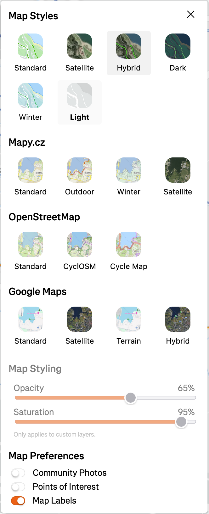

#  Route Recon for Strava

A browser extension that adds additional map layers and a panorama mode to Strava's route builder.

## Screenshots

<table align="center">
  <tr>
    <td align="center"></td>
    <td align="center"></td>
    <td align="center"></td>
  </tr>
  <tr>
    <td align="center"><sub>Heatmap with Mapy.cz Outdoor and Panorama</sub></td>
    <td align="center"><sub>Route Builder with Google Streetview</sub></td>
    <td align="center"><sub>Available Map Layers</sub></td>
  </tr>
</table>

## Features

### 🗺️ Additional Map Layers

Enhance your route planning with map layers from multiple providers:

- **Mapy.cz** - Standard, Outdoor, Winter, and Satellite views
- **OpenStreetMap** - Standard, CyclOSM, and Thunderforest Cycle Map
- **Google Maps** - Standard, Satellite, Terrain, and Hybrid views

### 👁️ Panorama Mode

Click anywhere on the map to view street-level imagery:

- **Mapy.cz Panorama** - Local coverage in Czech Republic
- **Google Street View** - Global coverage

Switch between providers with the control in the panorama window.

### 🎨 Map Styling Controls

Fine-tune your map appearance:

- **Opacity** - Adjust the transparency of custom map layers
- **Saturation** - Control the color saturation from grayscale to full color

## Installation

### Web Store

<!-- TODO: Add links to Firefox Add-ons and Chrome Web Store once published -->

*Coming soon to Firefox Add-ons and Chrome Web Store.*

### Manual

#### Firefox

1. Download the latest release
2. Navigate to `about:debugging#/runtime/this-firefox`
3. Click "Load Temporary Add-on" and select the `manifest.json` file

#### Chrome / Edge

1. Download the latest release
2. Navigate to `chrome://extensions` (or `edge://extensions`)
3. Enable "Developer mode"
4. Click "Load unpacked" and select the extension folder

## Configuration

### API Keys

Some features require free API keys. Click the **Route Recon Settings** button in Strava's map layer menu to configure them:

| Provider | Required For | Get Your Key |
|----------|--------------|--------------|
| **Mapy.cz** | Mapy.cz map layers & panorama | [developer.mapy.com](https://developer.mapy.com/account/projects) |
| **Google Maps** | Google map layers & Street View | [Google Cloud Console](https://console.cloud.google.com/google/maps-apis/credentials) |
| **Thunderforest** | Cycle Map layer | [manage.thunderforest.com](https://manage.thunderforest.com/) |

> **Privacy Note**: API keys are stored exclusively in your browser's local storage and never leave your machine.

### Panorama Provider

Switch between Mapy.cz and Google Street View:
- Use the control in the panorama window
- Or use the dropdown next to the panorama toggle button on the map

## Usage

1. Open [Strava Heatmap](https://www.strava.com/maps) or the [Route Builder](https://www.strava.com/maps/create)
2. Click the map layer menu to see additional options
3. To enable panorama mode, click the eye icon in the top-left map controls
4. Click anywhere on the map to view street-level imagery

## Development

### Build

```bash
npm install
npm run build
```

### Package

```bash
npm run zip
```

This creates `routerecon.zip` ready for distribution.

## License

MIT License - see [LICENSE](LICENSE) for details.

Copyright (c) 2026 Matyáš Strelec
